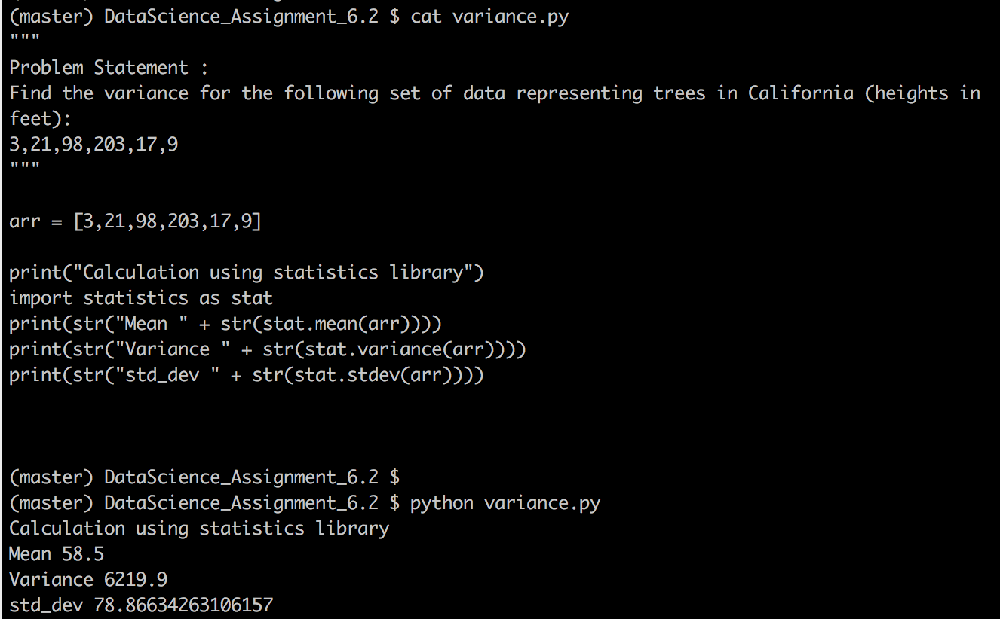

# Problem Statement :
```
#### Problem Statement​ ​1:
Find the variance for the following set of data representing trees in California (heights in
feet):
3,21,98,203,17,9
```

## Snapshot - variance implementation




